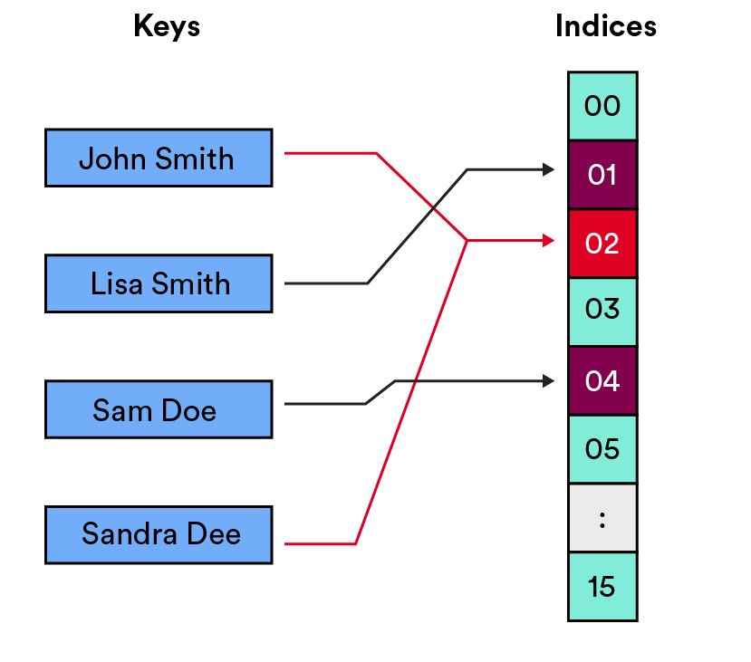
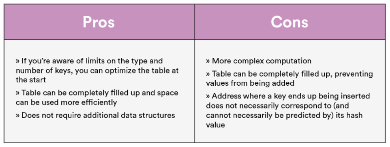
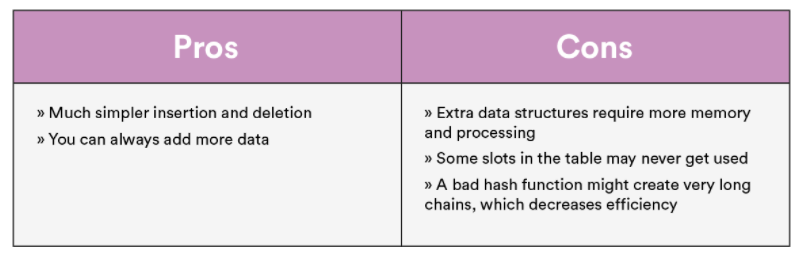
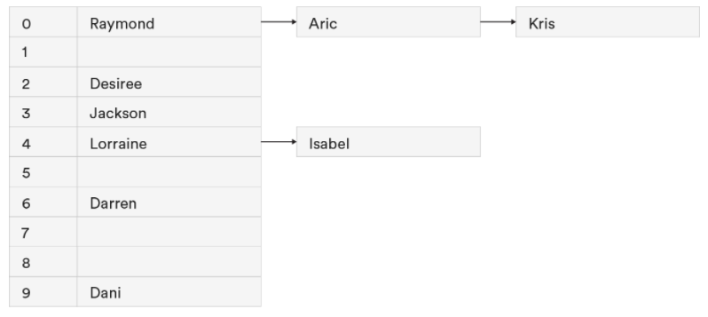
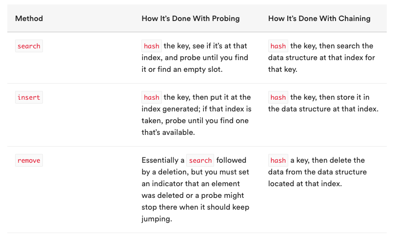
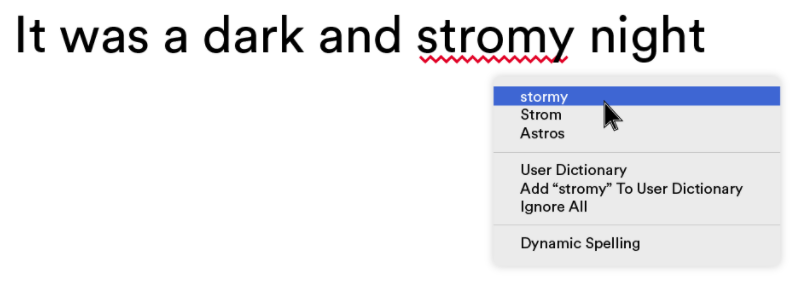
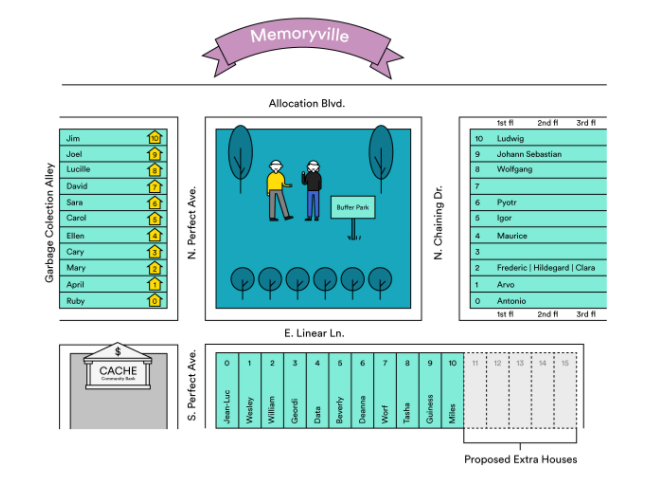

# Hash Tables!
<!-- Notes: Add pictures from Memoryville. -->

## 🥔 Hashing

At its most basic, hashing refers to the process of taking a key (i.e., a piece of data), scrambling it with an algorithm, and producing an index that’s used to sort the key into a hash table.

***

## 💡 Hash Function 
<!-- Talk to Henry. Mention the real world application of hash functions. RAM? -->
- A hash function is the algorithm takes in a key, such as a string or integer, for a data record (often a key-value pair) and returns an integer memory address, or an index in a table where that record can be stored. In other words, it maps some key from the very large universe of possible keys to a much smaller range of possible indices in a hash table.

- Hash functions can take lots of different forms! There’s only one absolute rule: *For the same input, the function should always return the same output.* 

- The rest are just general guidelines to follow when creating a hash function:
    - It should be simple and efficient.
    - It should distribute values evenly throughout the hash table.
    - It should avoid collisions.

***

## #️⃣ Hash Tables
A hash table is a list-like data structure that’s designed to quickly store and retrieve key data records. To store keys in a hash table, they must be mapped (with a hash function) to the set of possible indices in the table or to addresses of a memory location.

Any hash table implementation must include three basic methods:
- search
- insert
- remove

***

## 💥 Collisions 
When a hash function returns the same value for two different keys.

## ✏️ Solutions for Collisions:
### 📖 Open Addressing (aka probing)

Three most common types of open addressing:
1. Linear probing - The process of moving through a hash table until an open index is found.

2. Quadratic probing - If the slot at the hashed index is occupied, square the number of steps you take to the right (i.e., take one step, then four, then nine, then 16, then 25, etc.) until you find an open slot.
    - For example: If index 7 is taken, try 8. If index 8 is taken, try 12. If 12 is taken, try 21, then 37, and so on.

3. Double hashing - Come up with a secondary hash function. It must not ever return 0 and it must be able to return all addresses in the table.

### ⛓ Closed Addressing (aka chaining)

Chaining is another method of resolving collisions. Chaining means that each slot of the table can contain what is considered to be a “bucket,” which can hold more than one record. These buckets are data structures into which you can insert as many keys/records as you like.

***

### Hash Table Methods Comparison:

***

## 🎶 Miscellaneous! 
Can you think of a real life hash table?
 
 
 
 
 
 
 
 
 
 
 
 
 
 
Have you thought of an example?! 🧐
 
 
 
 
 
 
 
 
 
 
 
 
 
 

### Spell Check!

### Hashing is also used for...
encoding passwords!
 
cryptocurrency!

***

*** 

### ⛔️ Direct Access Table - Don't use it!
A direct access table is very time efficient but extremely space inefficient. That’s why we don’t use them — they’re a pipe dream for finding information.

***

### Hashing Resources!
[🤨 Top 20 Hashing Technique based Interview Questions](https://www.geeksforgeeks.org/top-20-hashing-technique-based-interview-questions/)

[🙋‍♀️ Hash Tables CodePen!](https://codepen.io/GAmarketing/pen/ZPQZrx)